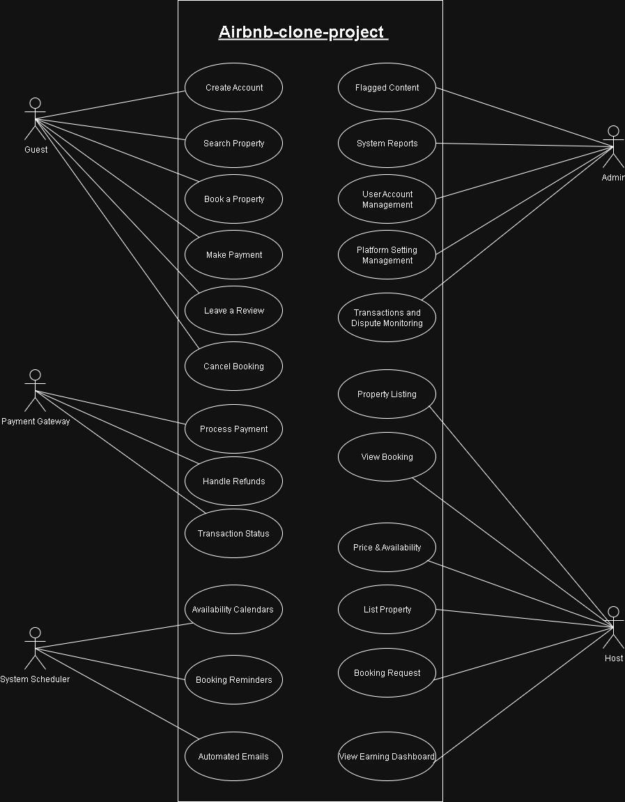

# Requirement Analysis in Software Development

## 📘 Introduction

This repository explores the foundational phase of the Software Development Life Cycle (SDLC): **Requirement Analysis**. It serves as a practical guide for developers, designers, and stakeholders to understand how to define, document, and validate software requirements before development begins.

Inspired by real-world projects like my [Airbnb Clone](https://github.com/your-username/airbnb-clone), this repo emphasizes the importance of planning and clarity in building scalable, user-centered applications.

---

## ❓ What is Requirement Analysis?

**Requirement Analysis** is the process of identifying, evaluating, and documenting the needs and expectations of users and stakeholders for a software system. It ensures that the development team understands *what* to build, *why* it’s needed, and *how* it should behave.

In the SDLC, this phase acts as the blueprint for design, development, and testing. Without proper analysis, projects risk misalignment, scope creep, and wasted resources.

---

## 🚀 Why is Requirement Analysis Important?

Here are three key reasons why Requirement Analysis is critical in software development:

- **Clarity and Alignment**  
  It ensures that all stakeholders share a common understanding of the system’s goals, features, and limitations.

- **Risk Reduction**  
  Early identification of constraints, dependencies, and edge cases helps prevent costly errors later in the project.

- **Efficient Development**  
  Well-defined requirements streamline design and coding, reducing rework and improving delivery speed.

---

## 🧩 Key Activities in Requirement Analysis

- **Requirement Gathering**  
  Collecting initial needs from clients, users, and stakeholders through interviews, surveys, or observation.

- **Requirement Elicitation**  
  Digging deeper to uncover hidden needs, assumptions, and priorities using techniques like brainstorming, prototyping, and workshops.

- **Requirement Documentation**  
  Structuring and recording requirements in formats like user stories, use cases, or requirement specification documents.

- **Requirement Analysis and Modeling**  
  Evaluating feasibility, consistency, and completeness. Modeling tools like flowcharts or use case diagrams help visualize system behavior.

- **Requirement Validation**  
  Confirming that documented requirements accurately reflect stakeholder needs and are achievable within project constraints.

---

## 📂 Types of Requirements

### ✅ Functional Requirements

These define **what the system should do** — its features and behaviors.

**Examples for a Booking Management System:**
- Users can search for properties by location and date.
- Hosts can list new properties with images and amenities.
- Users can book a property and receive confirmation via email.

### ⚙️ Non-functional Requirements

These define **how the system performs** — its quality attributes.

**Examples:**
- The system should respond to user actions within 2 seconds.
- Data should be encrypted during transmission (HTTPS).
- The platform must support up to 10,000 concurrent users.

---

## 🧾 Use Case Diagrams

**Use Case Diagrams** visually represent the interactions between users (actors) and the system. They help clarify system boundaries, user roles, and expected behaviors.

### 🎯 Benefits:
- Simplifies complex requirements
- Enhances communication between technical and non-technical stakeholders
- Supports early validation of system scope

---

## ✅ Acceptance Criteria

**Acceptance Criteria** are conditions that a feature must meet to be considered complete and functional. They guide development, testing, and client approval.

### 📦 Example: Checkout Feature

**Feature:** Booking Checkout

**Acceptance Criteria:**
- User must be logged in to complete a booking.
- Selected dates must be available and validated.
- Payment must be processed securely via integrated gateway.
- Confirmation email must be sent upon successful booking.

---

## 🤝 Contributing

This repository is open to contributions. Feel free to fork, suggest improvements, or share your own requirement analysis templates and diagrams.

📬 Contact:  
📱 +254 791 561 098  
📧 omondidanish77@gmail.com
